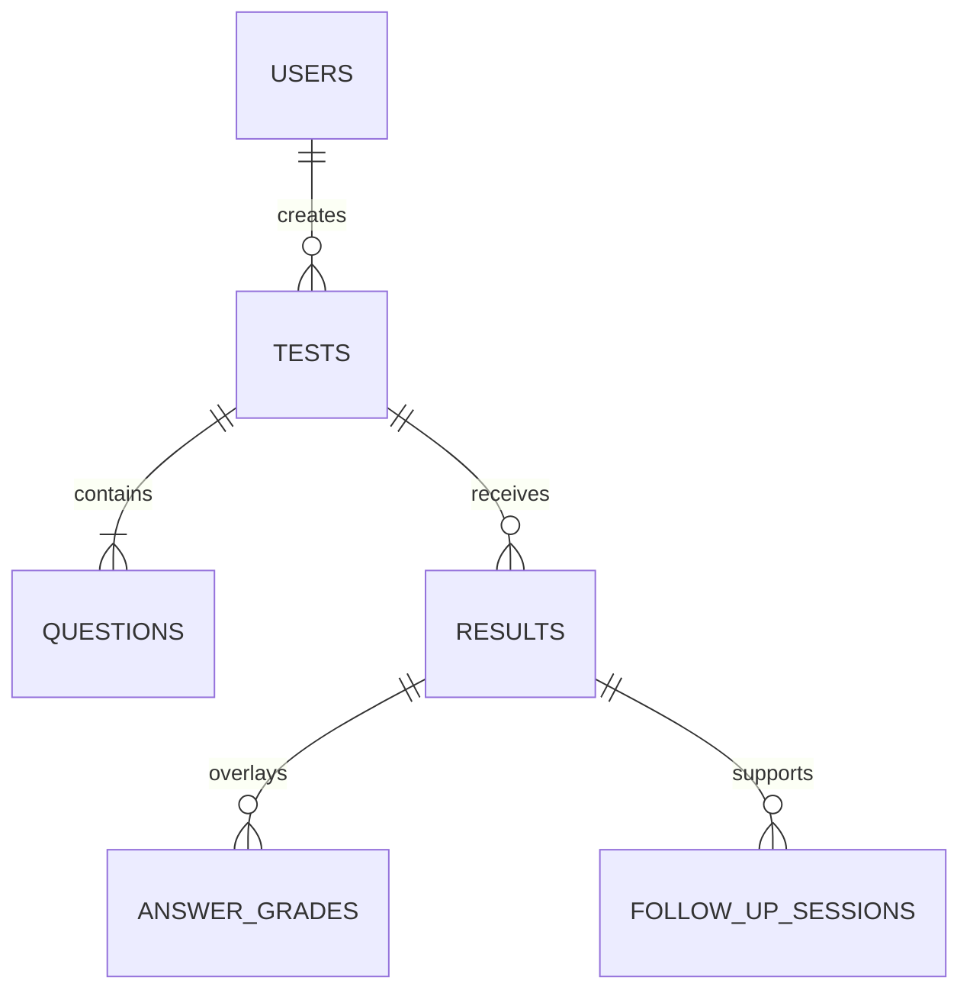

# ERD — Assessment và grading

```mermaid
erDiagram
    USERS ||--o{ TESTS : creates
    TESTS ||--|{ QUESTIONS : contains
    TESTS ||--o{ RESULTS : receives
    RESULTS ||--o{ ANSWER_GRADES : overlays
    RESULTS ||--o{ FOLLOW_UP_SESSIONS : supports
```

Cardinality được suy ra từ foreign-key usage và query relations; xem
[sources](sources.md) trước khi dùng làm migration authority.
