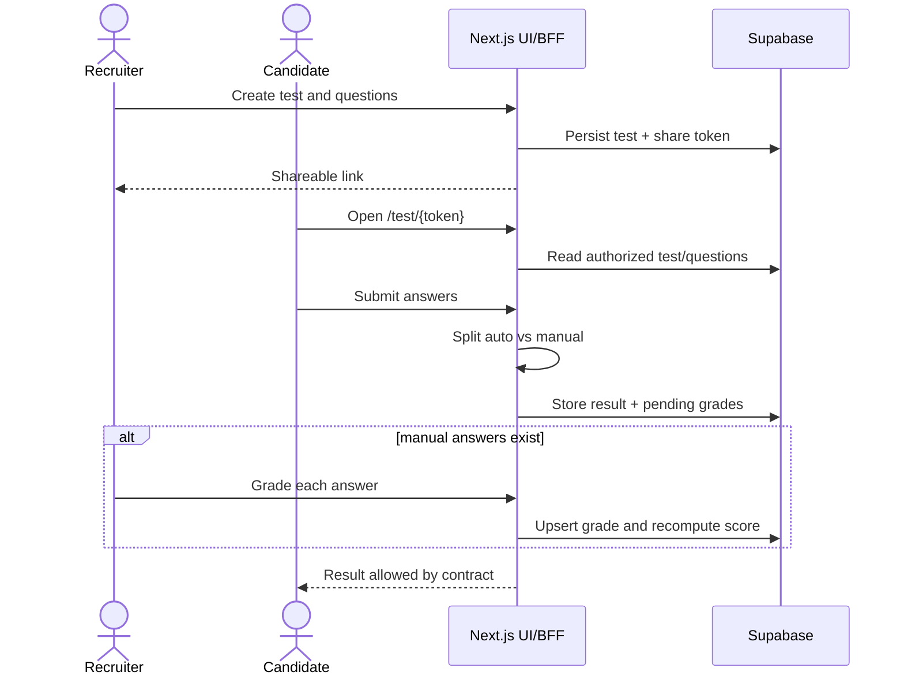

# Flows — Assessment và grading

```mermaid
sequenceDiagram
    actor R as Recruiter
    actor C as Candidate
    participant W as Next.js UI/BFF
    participant D as Supabase
    R->>W: Create test and questions
    W->>D: Persist test + share token
    W-->>R: Shareable link
    C->>W: Open /test/{token}
    W->>D: Read authorized test/questions
    C->>W: Submit answers
    W->>W: Split auto vs manual
    W->>D: Store result + pending grades
    alt manual answers exist
        R->>W: Grade each answer
        W->>D: Upsert grade and recompute score
    end
    W-->>C: Result allowed by contract
```
