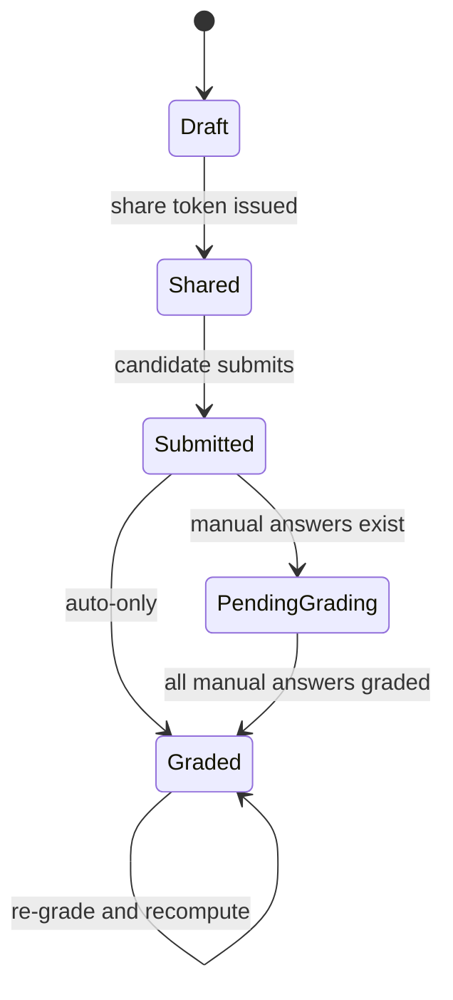

# States — Assessment và grading

```mermaid
stateDiagram-v2
    [*] --> Draft
    Draft --> Shared: share token issued
    Shared --> Submitted: candidate submits
    Submitted --> PendingGrading: manual answers exist
    Submitted --> Graded: auto-only
    PendingGrading --> Graded: all manual answers graded
    Graded --> Graded: re-grade and recompute
```

🟡 Tên Draft/Shared là mô hình hoá luồng quan sát được, không phải enum schema đã
được xác minh. `pending_grading` và `graded` là giá trị có trong code.
