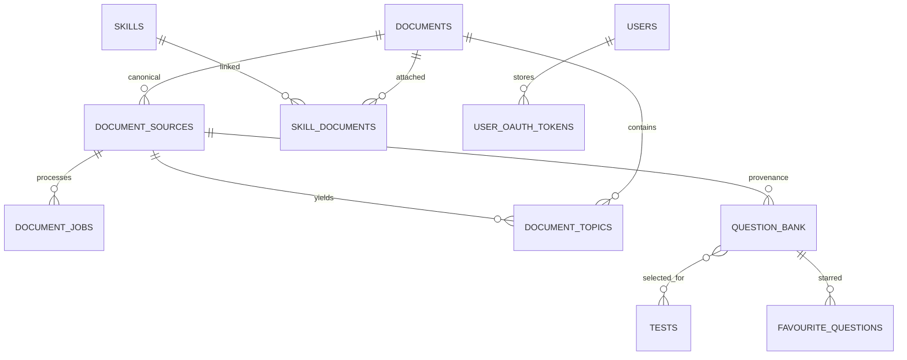

# ERD — Knowledge và question bank

```mermaid
erDiagram
    DOCUMENT_SOURCES ||--o{ DOCUMENT_JOBS : processes
    DOCUMENT_SOURCES ||--o{ DOCUMENT_TOPICS : yields
    DOCUMENT_SOURCES ||--o{ QUESTION_BANK : provenance
    DOCUMENTS ||--o{ DOCUMENT_TOPICS : contains
    DOCUMENTS ||--o{ DOCUMENT_SOURCES : canonical
    QUESTION_BANK }o--o{ TESTS : selected_for
    QUESTION_BANK ||--o{ FAVOURITE_QUESTIONS : starred
    SKILLS ||--o{ SKILL_DOCUMENTS : linked
    DOCUMENTS ||--o{ SKILL_DOCUMENTS : attached
    USERS ||--o{ USER_OAUTH_TOKENS : stores
```

Storage buckets (không phải table `public`): `document-sources`,
`candidate-cvs`, `interview-recordings`.
