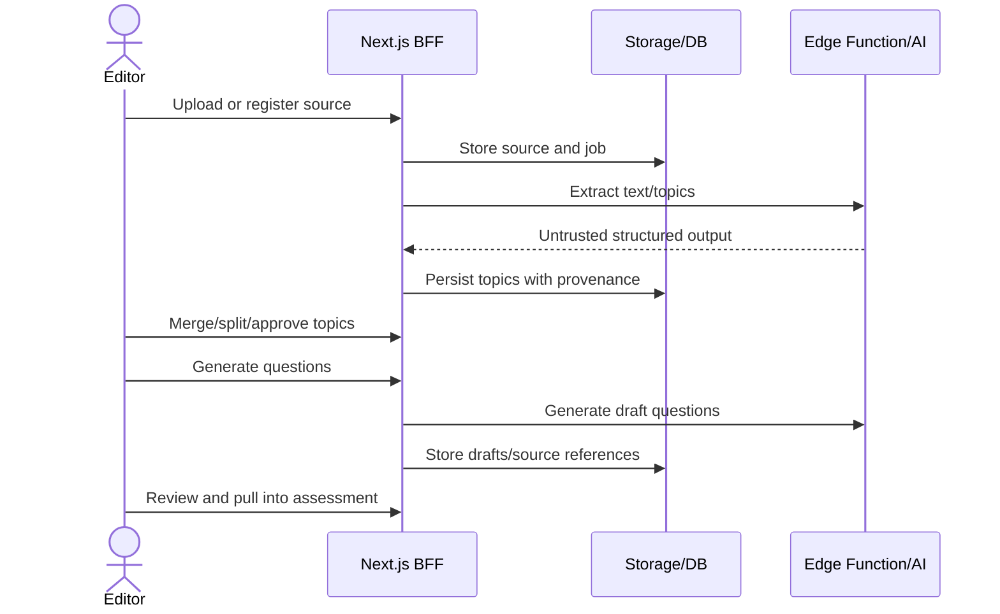

# Flows — Knowledge và question bank

```mermaid
sequenceDiagram
    actor E as Editor
    participant B as Next.js BFF
    participant S as Storage/DB
    participant F as Edge Function/AI
    E->>B: Upload or register source
    B->>S: Store source and job
    B->>F: Extract text/topics
    F-->>B: Untrusted structured output
    B->>S: Persist topics with provenance
    E->>B: Merge/split/approve topics
    E->>B: Generate questions
    B->>F: Generate draft questions
    B->>S: Store drafts/source references
    E->>B: Review and pull into assessment
```
