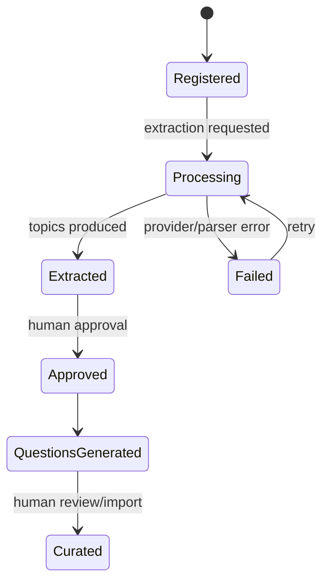

# States — Knowledge và question bank

```mermaid
stateDiagram-v2
    [*] --> Registered
    Registered --> Processing: extraction requested
    Processing --> Extracted: topics produced
    Processing --> Failed: provider/parser error
    Failed --> Processing: retry
    Extracted --> Approved: human approval
    Approved --> QuestionsGenerated
    QuestionsGenerated --> Curated: human review/import
```

🟡 State names tổng hợp từ route/job behavior; cần đối chiếu enum cụ thể trước
khi dùng làm API contract.
