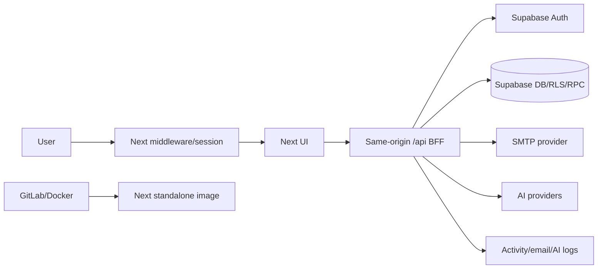

# Flows — Platform, communications và governance

```mermaid
flowchart LR
    U[User] --> M[Next middleware/session]
    M --> UI[Next UI]
    UI --> BFF[Same-origin /api BFF]
    BFF --> AUTH[Supabase Auth]
    BFF --> DB[(Supabase DB/RLS/RPC)]
    BFF --> SMTP[SMTP provider]
    BFF --> AI[AI providers]
    BFF --> LOG[Activity/email/AI logs]
    CI[GitLab/Docker] --> IMG[Next standalone image]
```
