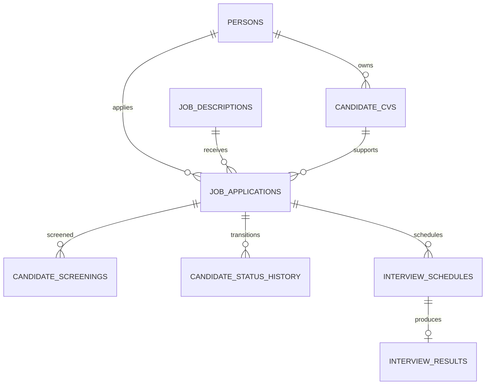

# ERD — Recruitment và interviews

```mermaid
erDiagram
    PERSONS ||--o{ JOB_APPLICATIONS : applies
    JOB_DESCRIPTIONS ||--o{ JOB_APPLICATIONS : receives
    PERSONS ||--o{ CANDIDATE_CVS : owns
    CANDIDATE_CVS ||--o{ JOB_APPLICATIONS : supports
    JOB_APPLICATIONS ||--o{ CANDIDATE_SCREENINGS : screened
    JOB_APPLICATIONS ||--o{ CANDIDATE_STATUS_HISTORY : transitions
    JOB_APPLICATIONS ||--o{ INTERVIEW_SCHEDULES : schedules
    INTERVIEW_SCHEDULES ||--o| INTERVIEW_RESULTS : produces
```
