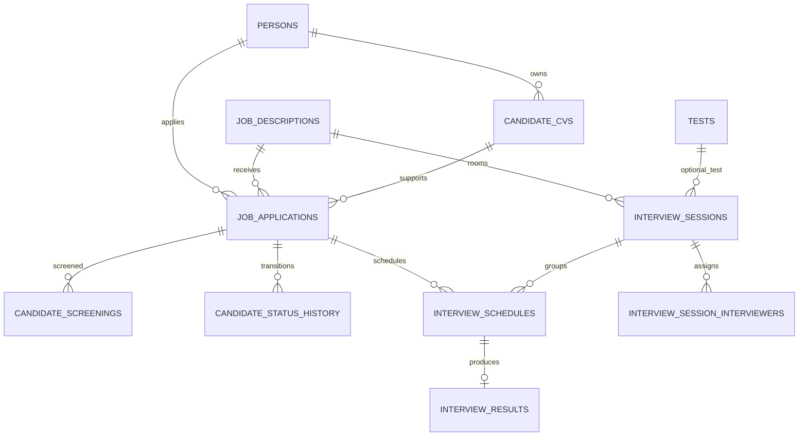

# ERD — Recruitment và interviews

```mermaid
erDiagram
    PERSONS ||--o{ JOB_APPLICATIONS : applies
    JOB_DESCRIPTIONS ||--o{ JOB_APPLICATIONS : receives
    PERSONS ||--o{ CANDIDATE_CVS : owns
    CANDIDATE_CVS ||--o{ JOB_APPLICATIONS : supports
    JOB_APPLICATIONS ||--o{ CANDIDATE_SCREENINGS : screened
    JOB_APPLICATIONS ||--o{ CANDIDATE_STATUS_HISTORY : transitions
    JOB_APPLICATIONS ||--o{ INTERVIEW_SCHEDULES : schedules
    INTERVIEW_SCHEDULES ||--o| INTERVIEW_RESULTS : produces
    JOB_DESCRIPTIONS ||--o{ INTERVIEW_SESSIONS : rooms
    INTERVIEW_SESSIONS ||--o{ INTERVIEW_SESSION_INTERVIEWERS : assigns
    INTERVIEW_SESSIONS ||--o{ INTERVIEW_SCHEDULES : groups
    TESTS ||--o{ INTERVIEW_SESSIONS : optional_test
```

Bảng `interview_sessions` / `interview_session_interviewers` có CREATE trong
`Backend/supabase/migrations` (20260506000000 + 20260508012639), khớp live.
