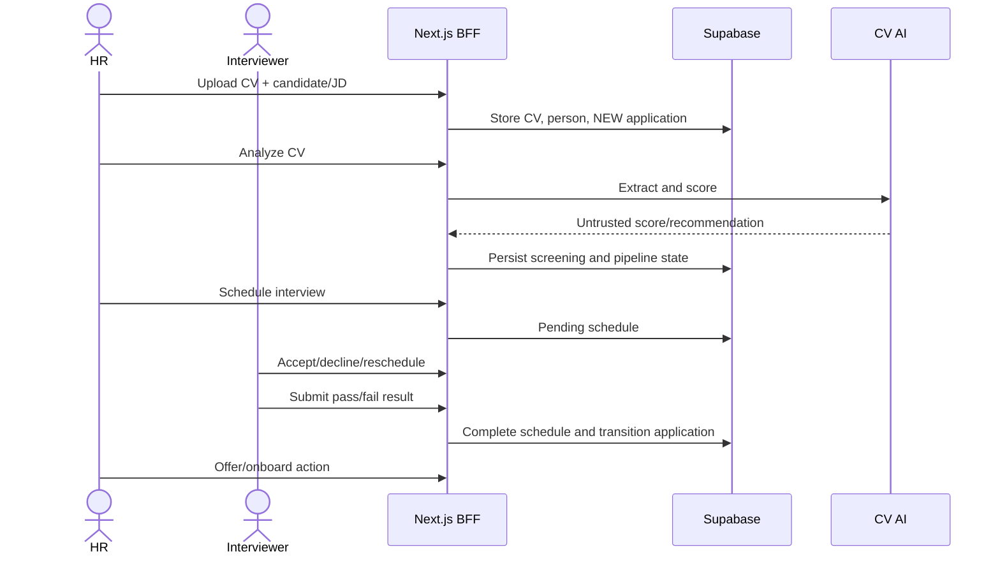

# Flows — Recruitment và interviews

```mermaid
sequenceDiagram
    actor HR
    actor I as Interviewer
    participant B as Next.js BFF
    participant D as Supabase
    participant AI as CV AI
    HR->>B: Upload CV + candidate/JD
    B->>D: Store CV, person, NEW application
    HR->>B: Analyze CV
    B->>AI: Extract and score
    AI-->>B: Untrusted score/recommendation
    B->>D: Persist screening and pipeline state
    HR->>B: Schedule interview
    B->>D: Pending schedule
    I->>B: Accept/decline/reschedule
    I->>B: Submit pass/fail result
    B->>D: Complete schedule and transition application
    HR->>B: Offer/onboard action
```
