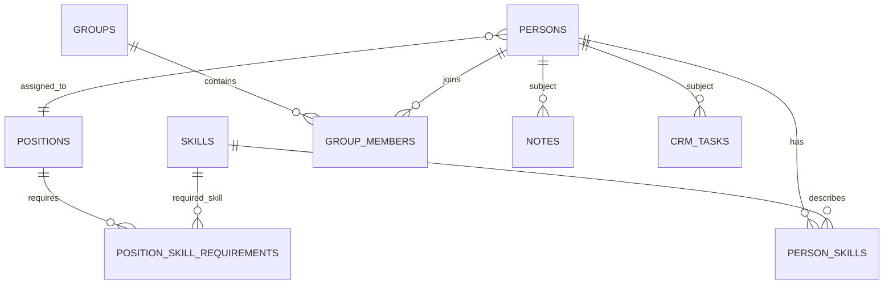

# ERD — Talent và CRM

```mermaid
erDiagram
    PERSONS }o--|| POSITIONS : assigned_to
    PERSONS ||--o{ PERSON_SKILLS : has
    SKILLS ||--o{ PERSON_SKILLS : describes
    POSITIONS ||--o{ POSITION_SKILL_REQUIREMENTS : requires
    SKILLS ||--o{ POSITION_SKILL_REQUIREMENTS : required_skill
    GROUPS ||--o{ GROUP_MEMBERS : contains
    PERSONS ||--o{ GROUP_MEMBERS : joins
    PERSONS ||--o{ NOTES : subject
    PERSONS ||--o{ CRM_TASKS : subject
```
