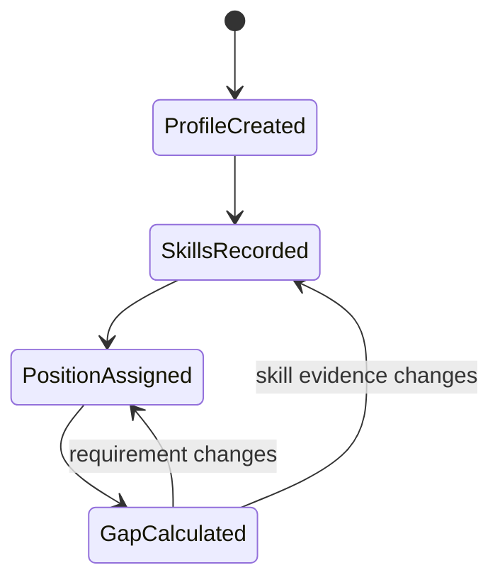

# States — Talent và CRM

```mermaid
stateDiagram-v2
    [*] --> ProfileCreated
    ProfileCreated --> SkillsRecorded
    SkillsRecorded --> PositionAssigned
    PositionAssigned --> GapCalculated
    GapCalculated --> SkillsRecorded: skill evidence changes
    GapCalculated --> PositionAssigned: requirement changes
```

🟡 Đây là lifecycle suy luận từ dependency graph, không phải persisted enum.
